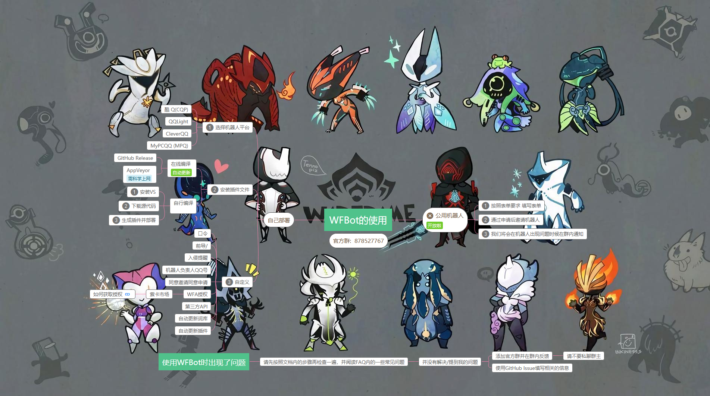

# WFBot

  
这是一个可进行多种游戏内任务通知以及查询的 Warframe 机器人.  
此项目使用 [AGPL](https://github.com/TRKS-Team/WFBot/blob/master/LICENSE) 协议授权. 如果你修改了源代码并应用到了机器人上, 请将最新的代码开源.  
我们**不允许**任何商业用途, 如果你发现有人违反, 请向我反馈.

> 基于 傻屌[Newbe](https://github.com/newbe36524) 的 [Newbe.Mahua.Framework](https://github.com/newbe36524/Newbe.Mahua.Framework) 开发.  
> 翻译 [词典](https://github.com/Richasy/WFA_Lexicon) 作者: 云之幻  
> 使用 [API](https://blog.richasy.cn/document/wfa/api/) 文档由云之幻整理  
> 任务 API 来自 [WarframeStat](https://docs.warframestat.us/)

 --by @Lasm_Gratel  
**~~骗钱~~赞助网址: [爱发电](https://afdian.net/@TheRealKamisama)**  
**您的赞助当然~~你妈~~会用来维持公用机器人, 也能推动我继续维护本插件.**

→[思维导图](https://www.processon.com/view/link/5d1e2622e4b0fdb331d33d23#map)←  


> 本插件附带自动更新.  
> 最新的插件 部署到 自动更新版本的机器人 上. 
> 如果我手滑引爆了所有机器人, 请不要慌张.  
> 如果真的全爆了, **没关系** 因为~~我的机器人~~也爆了.  
> 很快 [GitHub Release](https://github.com/TRKS-Team/WFBot/releases/latest) 上将会上传正确的版本 **手动更新**即可.  
> 此处记录引爆次数: \*4

> ~~目前有一个由我维护, 暂时稳定的机器人, 现在可以直接邀请入群 QQ: `2504645673`~~  
> ~~↑ 此公用机器人已经被永久封号,近期可能不会恢复了...有需求的请自行部署.~~  
> **用户请务必添加 QQ 群: [878527767](http://shang.qq.com/wpa/qunwpa?idkey=1a6da96f714791f3289ee2cafb98847efefd5c5d28e913b6bdf71b8d07e35c53)**   
> ~~目前**不建议**使用我部署的机器人! 负荷过大导致**经常失效**! 处在后面位置的群收到通知的速度会很慢!~~  
> **自己按照下面的说明部署可以享受完全体**

## (新)如何使用公用机器人

> 如果你使用过我的公用机器人 你就知道在2019.4.1公用机器人停止了服务  
> 从现在开始所提供的的公用机器人不一定稳定 但是我会尽量保证  
> 这要建立在你们的支持上  

> 除了下面表单邮件内所认证的机器人  
> 其他机器人的服务**不会**代表WFBot  
> 如果你遇到其他机器人出现了问题 请先找对应负责人反映

**第一步: Checkin**

我们的公用机器人需要一个小审核:  

1. 信息的真实度
2. 申请人必须在[官方群](http://shang.qq.com/wpa/qunwpa?idkey=1a6da96f714791f3289ee2cafb98847efefd5c5d28e913b6bdf71b8d07e35c53)里  

不难理解吧  
这两个条件只是为了能够联系到我的用户而已.

**第二步: 填写Google表单**  

**[GoogleForm](https://docs.google.com/forms/d/e/1FAIpQLSfwOeuOgbbnaSnMsRtL5QMSkao3k2u26FWwF5F4mV0mMtAQMg/viewform?usp=sf_link)**  
这个链接应该不需要科学上网就可以使用  
但你如果遇到困难 你可以求助[群](http://shang.qq.com/wpa/qunwpa?idkey=1a6da96f714791f3289ee2cafb98847efefd5c5d28e913b6bdf71b8d07e35c53)里的群友

**第三步: 收到邮件**

你将会收到一封邮件  
*(如果没有, 看看垃圾箱)*

如果拒绝申请: 请回到**第一步**  
如果通过申请：请按照**邮件**操作
## 如何部署

> 如果你在部署过程中遇到了问题, 请先查看下面的 FAQ. 如果还是无法解决, 可以添加上面的个人 QQ 群或者使用 [GitHub Issues](https://github.com/TRKS-Team/WFBot/issues).

[**部署 FAQ (常见问题解答)**](docs/faq.md)

### 第一步: 选择以下几种 QQ 机器人平台

|                             官网                             |  收费性质  |         插件压缩包名         |
| :----------------------------------------------------------: | :--------: | :----------------------: |
|        [酷 Q Pro / Air](https://cqp.cc/)        |    免费阉割版/收费     |        CQP.zip **(需要启用开发者模式)**       |
|        [QQLight](https://www.52chat.cc/download.php)         | 免费阉割版/收费 |        QQLight.zip        |
|        [Cleverqq(原 IRQQ)](https://www.cleverqq.cn/) |    免费阉割版/收费     |        CleverQQ.zip        |
|        [MyPCQQ](https://mypcqq.cc/)         |             免费阉割版/收费     |        MPQ.zip        |


> **酷 Q 平台 需要启用*开发者模式*才能看到本插件 (感谢来自一位用户的提醒), 具体启用方法参见 [FAQ](docs/faq.md).**  
> **我们建议你将你选择的机器人放在一台 24 小时运行的电脑/服务器上.**

### 第二步: 安装插件文件

#### 从 GitHub Release / AppVeyor (推荐)

1. 下载 [~~.NET Framework 4.6.2~~](https://dotnet.microsoft.com/download/thank-you/net462) 并安装. **经过用户反馈, 目前插件版本仅 [.NET Framework 4.7.1](https://dotnet.microsoft.com/download/thank-you/net471) 及以上版本可用, 对你的不便请谅解, 我们将很(gu)快(gu)修复这个问题**. (Windows 10 最新版自带4.7.1)
2. 从 [GitHub Release](https://github.com/TRKS-Team/WFBot/releases/latest) / [AppVeyor](https://ci.appveyor.com/project/TRKS-Team/wfbot/build/artifacts) 选择对应的平台并下载, 解压到机器人根目录.
3. 享受这个插件的的快感吧!

#### 或者: 自己编译

+ 新! 针对改代码(如文字提示)又想~~享受~~自动更新的客户 你可以写一个 WFBot 的[插件](docs/plugin.md) 


> 如果你不需要修改代码, 我们强烈建议你从上面下载.  
> 如果你修改了代码并应用到机器人上, 请在 GitHub 上开源其最新版本.  
> 我们强烈建议在 Windows 平台下编译这个项目.  
> **如果你使用非官方版 我们将不会解答除了代码结构和原理之外的其他问题.**

1. 安装 `Visual Studio 2019` (由于某个人的偷懒 不支持 VS2017.), 以及 `.NET Framework 4.6.2 SDK.`
2. 下载这个仓库, 使用 `TRKS.WF.QQBot\build.bat` 来生成一份插件.

   ```bash
    git clone https://github.com/TRKS-Team/WFBot.git
    ./WFBot/TRKS.WF.QQBot/build.bat
   ```

3. 将生成的所有 `TRKS.WF.QQBot\bin\[对应 QQ 平台]` 文件夹内的所有文件拖入机器人根目录.

### 第三步: 自定义

可以在插件设置内干一些奇怪的事情.  
可自定义的内容如下:

- 修改群通知功能所用的口令 **(默认为 7 个 \*)**
- 是否需要前导`/`来使用命令 **(默认需要)**
- 包含 哪些奖励的入侵任务 需要通知到群内 **(默认参见设置)**
- 用于接收报错的 QQ 号 **(调试使用, 建议留空)**
- 是否自动同意 别人邀请机器人入群 **(无需群内管理)** 和 自主申请入群 **(需群内管理)**
- WFA 授权的 `ClientId` 和 `ClientSecret` (非必须, 见下)
- 是否使用第三方词库 和 中转后的 WarframeMarket 接口 (需 WFA 授权)

可以使用的功能如下:

- 对所有 **启用了通知功能** 的群发送一条通知

### 启用 WFA 授权 **(非必须)**

设置内填入从云之幻处授权的 `ClientId` 和 `ClientSecret` 即可启用  
**如果你不知道这俩是干嘛的, 就别瞎填, 因为我的用户创造力都好强啊**

> **不启用授权不影响基本功能**

> **WM 查询** 可使用中转过后的服务器 **速度大概更高**  
> **紫卡市场** 使用 **必须** 启用 WFA 授权

**授权获取** 请查看 **[云之幻的 API 文档](https://blog.richasy.cn/document/wfa/api/)**

---

## 如何使用

### 群内命令

**设置内可以更改命令前无需斜杠.**

- **__赤毒__**: **/赤毒** 当前的所有赤毒任务
- **__仲裁__**: **/仲裁** 当前的仲裁警报
- **_Wiki_**: **/wiki [关键词]** 搜索[Wiki](https://warframe.huijiwiki.com/wiki/%E9%A6%96%E9%A1%B5)上的页面
- **_午夜电波_**: **/午夜电波** 每周/每日/即将过期 的挑战.
- **_机器人状态_**: **/status** 机器人的运行状态.
- **_警报_**: **/警报** 当前的所有警报.
  > _新警报也会自动发送到**启用了通知功能的群**._
- **_入侵_**: **/入侵** 当前的所有入侵.
  > _新入侵也会自动发送到**启用了通知功能的群**._
- **_突击_**: **/突击** 当前的所有突击.
- **_平原时间_**: **/平原** **地球平原** 现在的时间 和 **奥布山谷 (金星平原)** 现在的温度.
- **_活动_**: **/活动** 目前的所有活动
- **_虚空商人_**: **/虚空商人 (或奸商)** 奸商的状态.
  > _如果虚空商人已经抵达将会输出**所有的商品和价格**, 长度较长._
- **_WarframeMarket_**: **/查询 \[物品名称]**
  > - _目前模糊匹配功能十分强大,无需强制按照格式_
  > - _查询未开紫卡请输入: 手枪未开紫卡_
- **_紫卡市场_**: **/紫卡 \[武器名称]**
  > _数据来自 [**WFA 紫卡市场**](https://riven.richasy.cn/#/)_
- **_地球赏金_**: **/地球赏金 \[第几个(可选)]** 地球平原的 全部/单一 赏金任务.
- **_金星赏金_**: **/金星赏金 \[第几个(可选)]** 金星平原的 全部/单一 赏金任务.
- **_裂隙_**: **/裂隙** 全部裂隙.
- **_遗物_**: **/遗物 \[关键词] (eg. 后纪 s3, 前纪 B3)** 所有与关键词有关的遗物.
- **_翻译_**: **/遗物 \[关键词] (eg. 犀牛 prime, 致残突击)** 中 => 英 或 英 => 中
- **_小小黑_**: **/小小黑** 来查询目前追随者的信息.
  > _仅限此活动激活时可以使用_

另外还有一些不影响大局的调试命令和命令别名, 可以自己在代码中 ([私聊](https://github.com/TRKS-Team/WFBot/blob/master/TRKS.WF.QQBot/MahuaEvents/PrivateMessageReceivedMahuaEvent2.cs#L68)/[群聊](https://github.com/TRKS-Team/WFBot/blob/master/TRKS.WF.QQBot/MahuaEvents/GroupMessageReceivedMahuaEvent1.cs#L53)) 查阅.

### **私聊**命令

请不要把七个星号(默认口令)替换为群号.

- **用于启用群通知:** `添加群 [口令] [群号]`  
  默认为: `添加群 ******* 群号`
- **用于禁用群通知:** `删除群 [口令] [群号]`  
  默认为: `删除群 ******* 群号`

### 其他东西

直接邀请机器人机器人就会同意. (可修改配置)  
默认口令: `*******` (对没错就是七个星号, 有人猜得出我玩了什么梗吗)

---

## 用到的开源库

|                             名字                             |  开源协议  |         用来干嘛         |
| :----------------------------------------------------------: | :--------: | :----------------------: |
|        [Autofac](https://github.com/autofac/Autofac)         |    MIT     |        Mahua 依赖        |
|        [MediatR](https://github.com/jbogard/MediatR)         | Apache-2.0 |        Mahua 依赖        |
| [MessagePack](https://github.com/neuecc/MessagePack-CSharp/) |    MIT     |        Mahua 依赖        |
|         [Refit](https://github.com/reactiveui/refit)         |    MIT     |        Mahua 依赖        |
|             [Newbe.Mahua](http://www.newbe.pro/)             |    MIT     |      QQ 机器人框架       |
|      [Humanizer](https://github.com/Humanizr/Humanizer)      |    MIT     | 将时间转为中国人可读文字 |
|      [Newtonsoft.Json](https://www.newtonsoft.com/json)      |    MIT     |    比较可靠的 Json 库    |
|          [Costura](https://github.com/Fody/Costura)          |    MIT     |       集成引用文件       |
|             [Fody](https://github.com/Fody/Fody)             |    MIT     |       Costura 依赖       |
|  [Fastenshtein](https://github.com/DanHarltey/Fastenshtein)  |    MIT     |     字符串相似度比较     |
| [TextMessageCore](https://github.com/Cyl18/TextCommandCore)  |   WTFPL    |   我写的我写的!命令库    |

---

## 代码部分

代码注释极少... 并且大部分都是一些瞎记的.  
我不写注释是因为: **这代码这么难写 那他应该也难读**  
如果发现 Bug 或者你有好的想法可以在[GitHub Issue](https://github.com/TRKS-Team/WFBot/issues)里直接提出, 我会尽量去修改和实现.  
特别鸣谢 [@Cyl18](https://github.com/Cyl18)

> Cyl18 是我雇佣的一个劳工  
> 他每天坐在电脑前 看到我 Commit 的时候 他就戳一下 build.bat  
> 然后将插件文件打包 上传到 GitHub 上  
> 可怜的 Cyl18 每天要做这些工作维持生活

> Cyl18 又多了好几份工作  
> 每天 24 小时他都要坐在电脑面前  
> 看着 Warframe 游戏内的信息  
> 如果有新的 他就发到群里  
> 如果群里有人调用机器人 他就手动把信息发过去

## 贡献者列表 [排名不分先后]

- 代码贡献:
  > **TheRealKamisama** 项目发起人 主要开发者 文档撰写 问题回答 ~~骗钱~~  
  > **Cyl18** 项目维护 代码修改 文档修改 苦力 ~~装逼~~  
  > **qiutong123** 提供了翻译功能的代码 (PR)
- 问题贡献: wosiwq Aujin JJins mengpf
- 捐助者 **(真惨)**: KONYCN Trinitatem 爱发电用户\_pPYQ wosiwq 琪露诺 爱发电用户\_Ymhw SM_Chicov Flashbang233 果汁 DreaM1ku 780712 苟 Cy 君莫笑 Neptune 老腊肉 爱发电用户\_mQps
