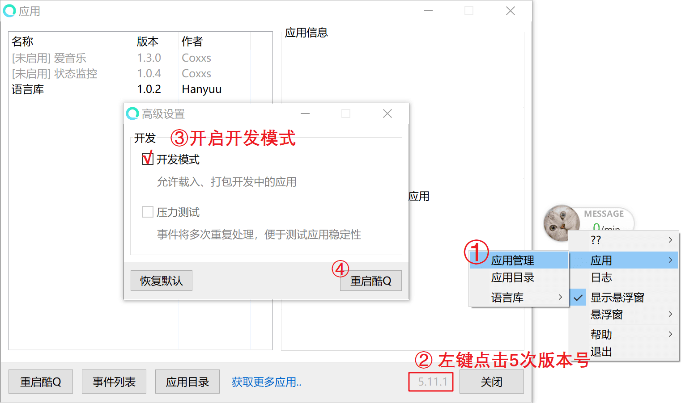
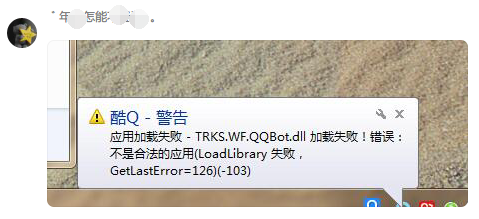
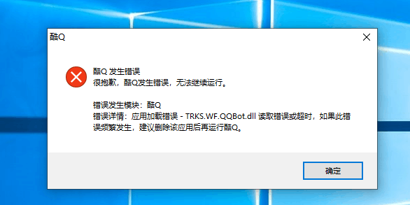
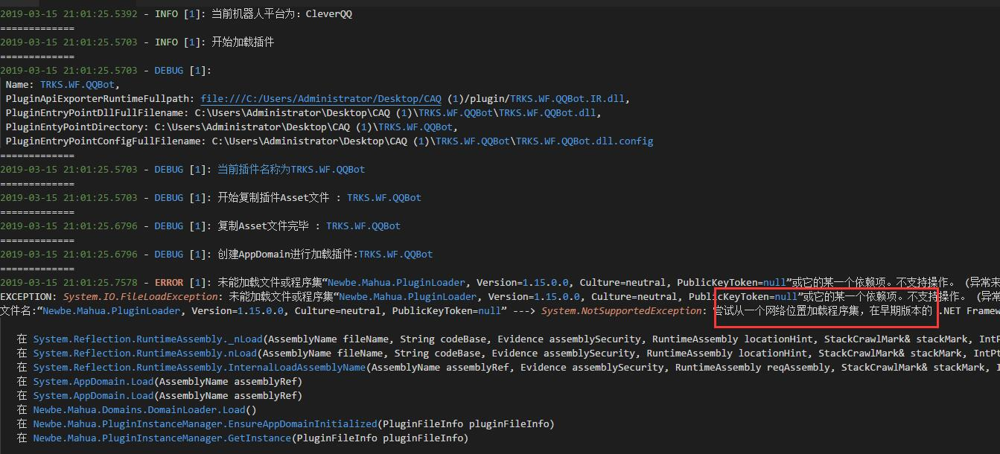

# 常见问题

## Q: 我在酷 Q 中根本看不到这个插件

- A: 启用开发者模式. (下面的图片来自 Mahua.)
  

---

## Q: LoadLibrary 失败



- A: 下载 ~~~[.NET Framework 4.6.2](https://dotnet.microsoft.com/download/thank-you/net462)~~~ 并安装.  
**经过用户反馈, 目前插件版本仅 [.NET Framework 4.7.1](https://dotnet.microsoft.com/download/thank-you/net471) 及[以上版本](https://dotnet.microsoft.com/download/thank-you/net472)可用**

---

## Q: 应用加载错误 - TRKS.WF.QQBot.dll 读取错误或超时



- A: 本弹窗的原因很复杂 最有可能是的是因为服务器配置太低导致读取时间过长  
   不要管这个窗口(也不要关闭) 等待几分钟 直接点酷 Q 的悬浮窗进行设置.  
   如果 酷 Q 没有显示悬浮窗 或 任务栏内也没有酷 Q, 你可以使用 GitHub Issue 或者直接加群反馈.

---

## Q: 无法启动机器人, log 下报错：尝试从一个网络位置加载程序集



- A: 在解压酷 Q 及插件文件之前, 先选择解除锁定，并点击确定，再解压压缩文件。


---

## Q: 我的机器人发出来的时间怎么是英文的


- A: 请将 `YUELUO\TRKS.WF.QQBot\zh-CN` 这个文件夹扔到机器人的根目录.  
   在 GitHub Release 上已经修复完成. 如果你自己编译还是会遇到这个问题.

---

## Q: GitHub Commit 获取异常, 可能是请求次数过多

申请 Token 请查看 [这里](token.md)
我们不会上传你的个人 Token. 但请保管好运行这个机器人的电脑.

## Q: Clone本库后使用build.bat后 TRKS.WF.QQBot\bin 无输出  

请尝试使用Powershell运行build.bat此脚本  
运行后如果在最后出现大量红字报错  
则检查上方的输出是否含有类似下方的输出  

```
Microsoft(R) 生成引擎版本 4.8.3752.0
```

版本号小于15  
用随便什么文本编辑器打开和build.bat同一目录下的build.ps1
```
Task Build -depends Nuget -Description "编译" {
    Exec {
        & "MSBuild.exe" "/p:Configuration=$configuration"
    }
}
```
这部分代码只将其中的
```
        & "MSBuild.exe" "/p:Configuration=$configuration"
```
改为
```
        &"这里填入一个指向 MSBuild.exe 的路径"
```
例如
```
        &"K:\Visual Studio\Microsoft Visual Studio\2017\Community\MSBuild\15.0\Bin\MSBuild.exe"
```
MSBuild一般装了vs会附赠一个  
在你的 {VS安装目录下}\Microsoft Visual Studio\2017\Community\MSBuild\15.0\Bin\MSBuild.exe 大概可以找到  
如果实在找不到可以用Everything(软件)搜一个版本≥15的Msbuild