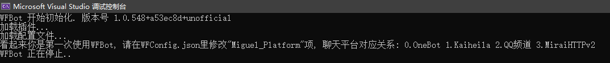
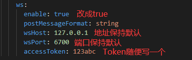
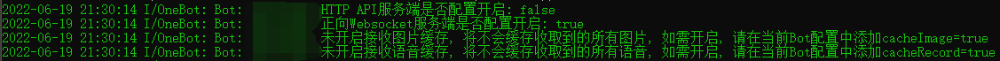

# 安装 WFBot

> 如果你在部署过程中遇到了问题, 请先查看下面的 FAQ. 如果还是无法解决, 可以添加 [QQ 群](http://shang.qq.com/wpa/qunwpa?idkey=1a6da96f714791f3289ee2cafb98847efefd5c5d28e913b6bdf71b8d07e35c53) 或者使用 [GitHub Issues](https://github.com/TRKS-Team/WFBot/issues). 群内问问题请指明你在哪一步遇到了问题.

> 你也可以使用 [**Docker 部署**](docker.md)

[**部署 FAQ (常见问题解答)**](faq.md)


## 第一步: 配置WFBot
1. 安装 .NET Core 3.1 [官方链接](https://dotnet.microsoft.com/download/dotnet-core/3.1) (Windows 请下载 Desktop Runtime)
   
   (Linux 用户 下载 .NET Core Runtime, 自己寻找答案, 或者加群来问)

2. 创建并且进入一个叫做 WFBot 的文件夹

3. 下载并且解压 WFBot: [链接](https://github.com/TRKS-Team/WFBot/releases/latest). 你需要下载下面这个东西:
    TODO
4. 启动 WFBot.exe, 你将看到以下内容:
   
   (也有可能会直接闪退, 在这步这是正常现象)  
5. 请在 WFBot 文件夹下找到 WFConfig.json, 修改以下的内容
     
   将后面的数字 5 修改为你想使用的聊天平台的对应数字序号, 对应表如下  

| 数字序号 | 通讯协议    | 支持平台    |
|----------|-------------|-------------|
| 0        | OneBot      | Mirai等     |
| 1        | 开黑啦      | 开黑啦(WIP) |
| 2        | QQ频道      | QQ频道(WIP) |
| 3        | MiraiHTTPv2 | Mirai       |

6. 再次双击 WFBot.exe 生成平台对应的配置文件  

7. 请按照你选择的平台进入下一步配置  
   - [配置OneBot协议](#第二步-配置onebot协议)
   - [配置MiraiHTTPv2协议](#第二步-配置miraihttpv2协议)

---
#### 如果你想自己编译...

clone 这个库, 运行 `build-wfbot.bat`, 编译的结果在 out 文件夹内.
如果你是直接下载的这个库, 在 vs 内右键 WFBot, 转到 Build -> Conditional conpliation symbols, 填入 `NoGitVersion`, 编译时使用 `build-wfbot-nogitversion.bat` 来正常编译.

- 针对改代码(如文字提示)又想享受官方编译最新或者自动更新的客户 你可以写一个 WFBot 的 [插件](plugin.md)

> 如果你不需要修改代码, 我们强烈建议你从上面下载.  
> 如果你修改了代码并应用到机器人上, 建议你在 GitHub 上开源其最新版本.  
> **如果你使用非官方版 我们将不保证运行安全与稳定.**

---
## 第二步: 配置 OneBot 协议  
1. 安装 Mirai
   > 如果你使用其他平台, 直接跳过这一步  

   [Mirai 配置教程](#附加教程-配置-mirai)  
   在[https://github.com/yyuueexxiinngg/onebot-kotlin/releases](https://github.com/yyuueexxiinngg/onebot-kotlin/releases)下载最新的 OneBot Mirai 插件  
   拖入 ./plugins 文件夹下  
   双击 mirai.cmd 等待输出
   

2. 配置 OneBot 正向 WebSocket  
   > OneBotConnector 基于的是 [OneBot](https://github.com/botuniverse/onebot-11) 协议给出的正向 WebSocket 通讯方案  
   > 你需要配置三样东西: AccessToken, 地址, 端口  
   > AccessToken 类似密码, 是你的 OneBot 机器人和 WFBot 通信时鉴权需要, 可随意选取.  
   > 地址和端口是 OneBot 机器人所提供 WebSocket 连接的地址, 如无特殊需求基本上可以保持默认.  
   > 具体每种 OneBot 机器人如何修改这三样东西可以查询它们给出的教程, 这里简单举个例子.

   以 OneBot Mirai 插件的配置文件作为例子, 修改这几行配置文件  
     
     
   改好后重启 Mirai, 等待那堆绿绿的输出.  
   
3. 配置 WFBot 的配置文件  
   打开 WFBot 文件夹下的 OneBotConfig.json  
   更改以下内容:  
   
4. 自定义 WFBot 的功能  
   - [自定义](#第三步可选-自定义)
---
## 第二步: 配置 MiraiHTTPv2 协议  
1. 安装 Mirai  
   [Mirai配置教程](#附加教程-配置-mirai)  
2. 安装 Mirai-HTTP 插件  
   从 [mirai-api-http GitHub Release](https://github.com/project-mirai/mirai-api-http/releases/latest) 下载插件 (中国下载可能较慢)  
   下载后将 .jar 文件拖入 mirai 文件夹下的 plugins 文件夹内  
   双击 mirai.cmd 等待以下输出: 
   
3. 配置 Mirai-HTTP 插件  
   打开 mirai\config\net.mamoe.mirai-api-http\settings.yml  
   将下面的内容复制粘贴覆盖到文件内, 按照注释修改. 

```yaml
adapters: 
   - http
   - ws 
debug: false
enableVerify: true
verifyKey: INITKEYIxzgOFzT ## 建议修改为一个!!!与下文一样!!!的Token
singleMode: false
cacheSize: 4096
adapterSettings: 
  ws:
  ## websocket server 监听的本地地址
  ## 一般为 localhost 即可, 如果多网卡等情况，自定设置
    host: localhost

    ## websocket server 监听的端口
    ## 与 http server 可以重复, 由于协议与路径不同, 不会产生冲突
    port: 8080
    
    reservedSyncId: -1
    http:
      ## http server 监听的本地地址
      ## 一般为 localhost 即可, 如果多网卡等情况，自定设置
      host: localhost

      ## http server 监听的端口
      ## 与 websocket server 可以重复, 由于协议与路径不同, 不会产生冲突
      port: 8080

      ## 配置跨域, 默认允许来自所有域名
      cors: [*]
```

4. 配置 Mirai  
   打开 WFBot 文件夹下的 Miraiv2Config.json, 按照说明修改配置文件
     

5. 自定义 WFBot 的功能  
   - [自定义](#第三步可选-自定义)
--- 
## 第三步(可选): 自定义

> WFBot 控制台内输入 ui 可以打开设置窗口 (仅 Windows) (以后可能会适配全平台)
> 

可自定义的内容如下:

- 修改群通知功能所用的口令 **(默认为 7 个 \*)**
- 是否需要前导`/`来使用命令 **(默认需要)**
- 包含 哪些奖励的入侵任务 需要通知到群内 **(默认参见设置)**
- 用于管理机器人的 QQ 号 **(填你自己的, 用来修改敏感信息和接收报错)**
- 是否自动同意 别人邀请机器人入群 **(无需群内管理)** 和 自主申请入群 **(需群内管理)**
- WFA 授权的 `ClientId` 和 `ClientSecret` (非必须, 见下)
- WM 商品和紫卡查询单次发送的条数
- 每分钟机器人调用次数限制
- 是否使用中转后的 WarframeMarket 接口 (需 WFA 授权)
- [GithubToken](token.md) **(非必须)**

可以使用的功能如下:

- 对所有 **启用了通知功能** 的群发送一条通知

### 启用 WFA 授权 **(非必须)**

设置内填入从云之幻处授权的 `ClientId` 和 `ClientSecret` 即可启用  
**如果你不知道这俩是干嘛的, 就别瞎填, 因为我的用户创造力都好强啊**

> **不启用授权不影响基本功能**

> **WM 查询** 可使用中转过后的服务器 **速度大概更高**  
> **紫卡市场** 使用 **必须** 启用 WFA 授权

**授权获取** 请查看 **[云之幻的 API 文档](https://www.richasy.cn/wfa-api-apply/)**

---
## 附加教程: 配置 mirai
> mirai 安装教程可能较旧. 总体上来说你需要的只有登录上 mirai 和 mirai-api-http 插件. 我们将在等会(鸽了)更新这个教程.

1. 创建并进入一个叫做 mirai 的文件夹.

2. 前往 <https://github.com/iTXTech/mcl-installer> 安装.

<!--
5. 运行一下 mirai: 双击 mcl.cmd, 等待 mirai 输出
    (如果这一步窗口闪一下就没了, 检查上面的 Java 配置是否正确, 特别是文件放的位置), 然后关闭 mirai (直接关闭窗口或者输入 `exit`).

6. 下载 mirai-api-http 插件: 从 [mirai-api-http GitHub Release](https://github.com/project-mirai/mirai-api-http/releases/latest) 下载 (中国下载可能较慢), 或 [WFBot 镜像](https://orange-hill-1312.therealkamisama.workers.dev/https://github.com/project-mirai/mirai-api-http/releases/download/v1.9.6/mirai-api-http-v1.9.6.mirai.jar) (版本为 1.9.6, 不一定最新), 下载 mirai-api-http-vx.x.x.mirai.jar, 放入 plugins 文件夹.

7. 再次启动 mirai 并等待输出
   

8. 打开 config\net.mamoe.mirai-api-http\setting.yml 文件. 将 `port` (端口号, 范围 \[1-65535\], 这里普及一下知识, 摘自维基百科, `在TCP协议中，端口号0是被保留的，不可使用。1--1023 系统保留，只能由root用户使用。1024---4999 由客户端程序自由分配。5000---65535 由服务器端程序自由分配。`所以你最好填5000-65535之间的数, 如果冲突的话可以换) 和 `authKey` (连接用密码, 至少 8 位) 修改为一个独特的内容. (后面配置 WFBot 会用到)
   

9. 在有 mirai.cmd 文件夹下, `Shift + 右键`资源管理器的文件夹空白部分, 点击 '在此处打开命令窗口'.
   

10. 执行 `./mcl --update-package net.mamoe:mirai-login-solver-selenium --channel nightly --type plugin`
    

11. 启动 mirai. 如果你没有 Firefox / Chrome 建议先安装. 登录过程可能会用到. 使用 `login [账号] [密码]` 登录或者 `autologin add [账号] [密码]` 配置自动登录 QQ.

-->