# 安装 WFBot

> 如果你在部署过程中遇到了问题, 请先查看下面的 FAQ. 如果还是无法解决, 可以添加 [QQ 群](http://shang.qq.com/wpa/qunwpa?idkey=1a6da96f714791f3289ee2cafb98847efefd5c5d28e913b6bdf71b8d07e35c53) 或者使用 [GitHub Issues](https://github.com/TRKS-Team/WFBot/issues). 群内问问题请指明你在哪一步遇到了问题.

[**部署 FAQ (常见问题解答)**](faq.md)

目录:

- [配置 mirai](#第一步-配置-mirai)
- [配置 WFBot](#第二步-配置-wfbot)
  - [如果你想自己编译...](#如果你想自己编译)
- [自定义](#自定义)
  - [启用 WFA 授权 (非必须)](#启用-wfa-授权-非必须)

首先新建两个文件夹, 分别叫 WFBot 和 mirai _并不一定非得是这个名字, 仅以方便演示为主_

## 第一步: 配置 mirai

1. 进入 mirai 文件夹.
2. 下载 Java: 从 [清华大学开源软件镜像站(推荐)](https://mirrors.tuna.tsinghua.edu.cn/AdoptOpenJDK/15/jre/x64/), [adoptopenjdk](https://adoptopenjdk.net/releases.html?variant=openjdk15&jvmVariant=hotspot) 或者 [openjdk](https://openjdk.java.net/projects/jdk/15/) 下载对应系统版本的 zip 版本的 Java, 解压到 jre 文件夹中(新建). 解压后应该像下面这样:
   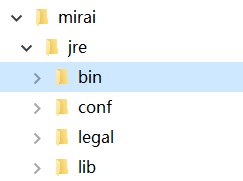  
   (确保 jre 下面就有 bin 文件夹)

3. 下载 mcl: 从 [MCL GitHub Release](https://github.com/iTXTech/mirai-console-loader/releases/latest) (中国大概很难下) 或者 [WFBot 镜像](https://orange-hill-1312.therealkamisama.workers.dev/https://github.com/iTXTech/mirai-console-loader/releases/download/v1.0.3/mcl-1.0.3.zip) (目前为 1.0.3 版本) 下载 mcl 并解压. 解压完后大概像这样:
   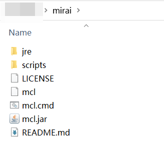

4. 修改 mcl.cmd: 用记事本打开 mcl.cmd, 把 `set JAVA_BINARY` 的那一行改为 `set JAVA_BINARY="jre/bin/java.exe"`:

   ```diff
   @echo off
   -set JAVA_BINARY=java
   +set JAVA_BINARY="jre/bin/java.exe"
   %JAVA_BINARY% -jar mcl.jar %*
   ```

5. 运行一下 mirai: 双击 mcl.cmd, 等待 mirai 输出
   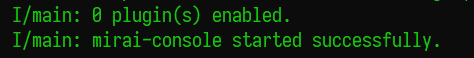 (如果这一步窗口闪一下就没了, 检查上面的 Java 配置是否正确, 特别是文件放的位置), 然后关闭 mirai (直接关闭窗口或者输入 `exit`).

6. 下载 mirai-api-http 插件: 从 [mirai-api-http GitHub Release](https://github.com/project-mirai/mirai-api-http/releases/latest) 下载 (中国下载可能较慢), 或 [WFBot 镜像](https://orange-hill-1312.therealkamisama.workers.dev/https://github.com/project-mirai/mirai-api-http/releases/download/v1.9.6/mirai-api-http-v1.9.6.mirai.jar) (版本为 1.9.6, 不一定最新), 下载 mirai-api-http-vx.x.x.mirai.jar, 放入 plugins 文件夹.

7. 再次启动 mirai 并等待输出
   

8. 打开 config\net.mamoe.mirai-api-http\setting.yml 文件. 将 `port` (端口号, 不能大于 65536) 和 `authKey` (连接用密码, 至少 8 位) 修改为一个独特的内容. (后面配置 WFBot 会用到)
   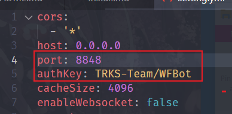

9. 在有 mirai.cmd 文件夹下, `Shift + 右键`资源管理器的文件夹空白部分, 点击 '在此处打开命令窗口'.
   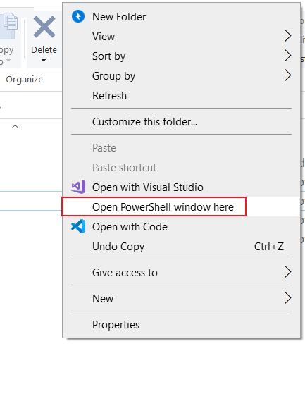

10. 执行 `./mcl --update-package net.mamoe:mirai-login-solver-selenium --channel nightly --type plugin`
    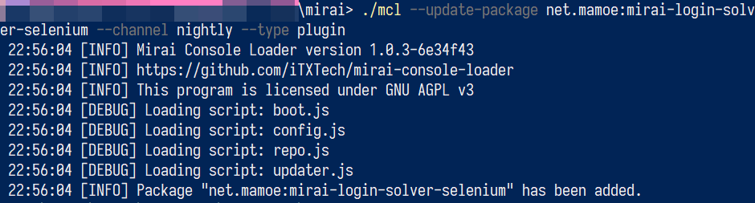

11. 启动 mirai. 如果你没有 Firefox / Chrome 建议先安装. 登录过程可能会用到. 使用 `login [账号] [密码]` 登录或者 `autologin add [账号] [密码]` 配置自动登录 QQ.

---

## 第二步: 配置 WFBot

1. 安装 .NET Core 3.1 [官方链接](https://dotnet.microsoft.com/download/dotnet-core/3.1) (Windows 请下载 Desktop Runtime)
   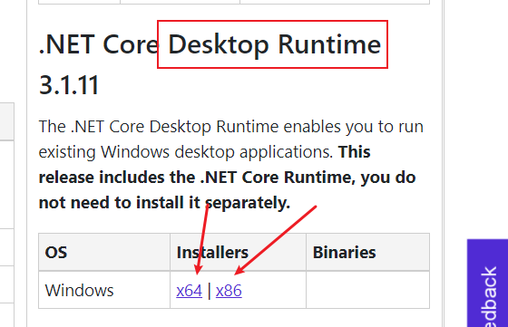
   (Linux 用户 下载 .NET Core Runtime, 自己寻找答案, 或者加群来问)

2. 进入 WFBot 文件夹

3. 下载 WFBot: [链接](https://github.com/TRKS-Team/WFBot/releases/latest). 你需要下载这两个东西:
   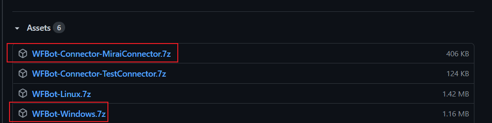

4. 解压: 把 WFBot-Windows.7z 直接解压, 接着把 WFBot-Connector-MiraiConnector.7z 解压到 WFBotConnector 文件夹内. 解压完成后像这样:
   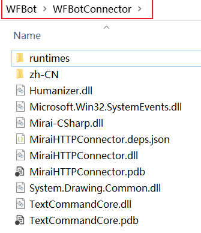
   (确保 MiraiHTTPConnector.dll 直接在 WFBotConnector 内)

5. 启动 WFBot.exe, 你将看到以下内容:
   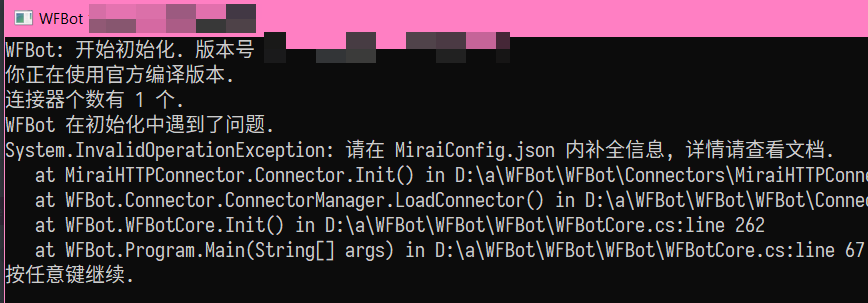

6. 打开 MiraiConfig.json, 配置好:
   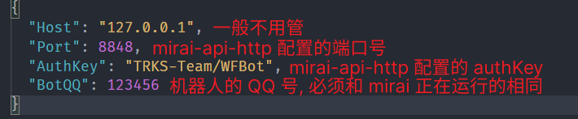
   保存.

7. 再次打开 WFBot, 就可以运行了.  
   **注意 你得先打开 mirai, 再打开 WFBot**

8. 可以在控制台输入 ui 来打开设置界面. 直接修改 WFConfig.json 也行.

### 如果你想自己编译...

clone 这个库, 运行 `build-wfbot.bat` 和 `build-connector.bat`, 编译的结果在 out 文件夹内.
如果你是直接下载的这个库, 在 vs 内右键 WFBot, 转到 Build -> Conditional conpliation symbols, 填入 `NoGitVersion`, 编译时使用 `build-wfbot-nogitversion.bat` 来正常编译.

- 针对改代码(如文字提示)又想享受官方编译最新或者自动更新的客户 你可以写一个 WFBot 的 [插件](plugin.md)

> 如果你不需要修改代码, 我们强烈建议你从上面下载.  
> 如果你修改了代码并应用到机器人上, 建议你在 GitHub 上开源其最新版本.  
> **如果你使用非官方版 我们将不保证运行安全与稳定.**

---

## 自定义

> WFBot 控制台内输入 ui 可以打开设置窗口 (仅 Windows) (以后可能会适配全平台)
> 

可自定义的内容如下:

- 修改群通知功能所用的口令 **(默认为 7 个 \*)**
- 是否需要前导`/`来使用命令 **(默认需要)**
- 包含 哪些奖励的入侵任务 需要通知到群内 **(默认参见设置)**
- 用于管理机器人的 QQ 号 **(填你自己的, 用来修改敏感信息和接收报错)**
- 是否自动同意 别人邀请机器人入群 **(无需群内管理)** 和 自主申请入群 **(需群内管理)**
- WFA 授权的 `ClientId` 和 `ClientSecret` (非必须, 见下)
- WM 商品和紫卡查询单次发送的条数
- 每分钟机器人调用次数限制
- 是否使用中转后的 WarframeMarket 接口 (需 WFA 授权)
- [GithubToken](token.md) **(非必须)**

可以使用的功能如下:

- 对所有 **启用了通知功能** 的群发送一条通知

### 启用 WFA 授权 **(非必须)**

设置内填入从云之幻处授权的 `ClientId` 和 `ClientSecret` 即可启用  
**如果你不知道这俩是干嘛的, 就别瞎填, 因为我的用户创造力都好强啊**

> **不启用授权不影响基本功能**

> **WM 查询** 可使用中转过后的服务器 **速度大概更高**  
> **紫卡市场** 使用 **必须** 启用 WFA 授权

**授权获取** 请查看 **[云之幻的 API 文档](https://www.richasy.cn/wfa-api-apply/)**
